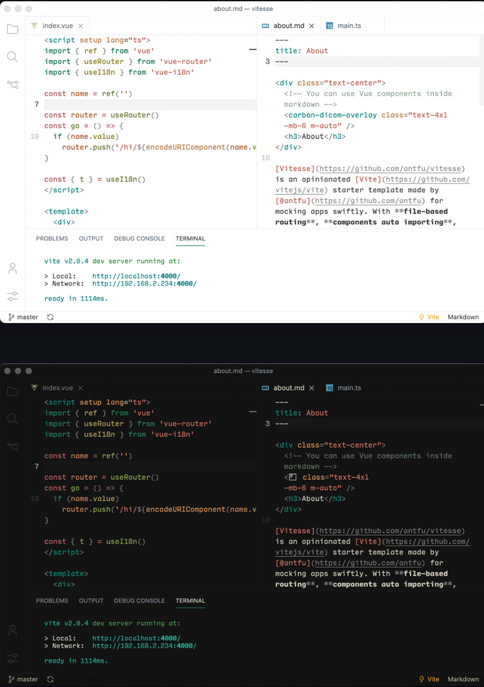

每次重装系统或者切换账号等都需要重新配置 vscode, 虽然内置有云同步功能, 但某些时候不能用或者忘记, 还是写出来方便随时查阅备忘使用, `setting、theme、plugins .... etc`, 仅适合笔者但可供参考 (`各人有各人的技术品味`)

<!-- truncate -->


## 常用配置

### 缩进和换行符

- [x] **Editor: Tab Size**
- [x] **Files: Eol**

1. `Tab Size` 也就是按 Tab 缩进的大小设置为 `2` , 即 `2 个空格`
2. 换行符设置为 `LF(\n)` , `Windows`系统为`CRLF`

### 保存并格式化

- [x] **Editor: Format On Save**

按下 ` Ctrl / Command + S ` 自动格式化文件

### 自动换行

- [x] **Editor: Word Wrap**

选项打开为 `on` , 换行限制为 `80` 个字符 (取决于你屏幕大小)

### 编辑器/终端 字体

- [x] **Editor: Font Family**
- [x] **Terminal > Integrated:Font Family**

- 编辑器字体使用 `JetBrains Mono` , 终端字体使用 `MesloLGM NF`

### 语法提示不区分大小写

> 这个忘记哪里配置了...

### 代码补全默认不选中第一项

- [ ] **Editor > Suggest: Snippets Prevent Quick Suggestions**

将图中的“**snippets prevent quik suggestion**”取消勾选

其原因是补全后编译器认为代码处于活动中，勾选中后编译器会阻止快速建议，也就是代码提示，会导致无法用键盘选中提示，只能通过鼠标选中。

### 注释颜色
> 个人喜好绿色的注释, 相比默认的灰色更加显眼

在 `settions.json` 文件中添加配置项
```json
"editor.tokenColorCustomizations": {
    "comments": "#1fd160"
  },
```

### 平滑鼠标插入

- [ ] **Editor: Cursor Smooth Caret Animation**

可以在设置中找到上面选项打开为 `on` , 或者在 `setting.json`中添加下面配置

```json
"editor.cursorSmoothCaretAnimation": "on",
```
### 平滑滚动页面

- [ ] **Editor: Smooth Scrolling**

可以在设置中找到上面选项打开为 `on` , 或者在 `setting.json`中添加配置`"editor.smoothScrolling": true`

### Github 账号云同步

左下角齿轮**⚙**设置处 -> `Setting sync is On`

毕竟 `VsCode` 是微软用 `TypeScript` 开发的一个强大编辑器, 而且 `Github` 在前几年就已经被微软收购了, 都是自家的自然可以通过 `Github` 账号进行配置云同步

## setting.json

:::tip 用户配置
`setting.json` 是用户对编辑器的个性化配置, 在这里你可以自行改造 VsCode的样子,  个人配置如下:
:::

```json
{
  // Visuals
  "workbench.iconTheme": "file-icons",
  "workbench.colorTheme": "Vitesse Light",
  "[javascriptreact]": {
    "editor.defaultFormatter": "esbenp.prettier-vscode"
  },
  "[javascript]": {
    "editor.defaultFormatter": "esbenp.prettier-vscode"
  },
  "git.autofetch": true,
  "git.confirmSync": false,
  "git.suggestSmartCommit": true,
  "git.enableSmartCommit": true,
  "git.untrackedChanges": "separate",
  "files.eol": "\n",
  "files.insertFinalNewline": true,
  "files.simpleDialog.enable": true,
  "typescript.updateImportsOnFileMove.enabled": "always",

  // Editor
  "editor.fontSize": 16,
  "editor.fontFamily": "JetBrains Mono, monospace",
  "editor.fontLigatures": true,
  "editor.wordWrap": "on",
  "editor.formatOnSave": true,
  "editor.tokenColorCustomizations": {
    "comments": "#1fd160"
  },
  "editor.accessibilitySupport": "off",
  "editor.cursorSmoothCaretAnimation": "on",
  "editor.smoothScrolling": true,
  "editor.find.addExtraSpaceOnTop": false,
  "editor.guides.bracketPairs": "active",
  "editor.inlineSuggest.enabled": true,
  "editor.multiCursorModifier": "ctrlCmd",
  "editor.renderWhitespace": "boundary",
  "editor.suggestSelection": "first",
  "editor.tabSize": 2,
  "editor.unicodeHighlight.invisibleCharacters": false,
  "editor.codeActionsOnSave": {
    "source.fixAll": false,
    "source.fixAll.eslint": true, // this allows ESLint to auto fix on save
    "source.organizeImports": false
  },
  "explorer.confirmDelete": false,
  "explorer.confirmDragAndDrop": false,
  "terminal.integrated.fontFamily": "MesloLGM NF",
  "terminal.integrated.cursorBlinking": true,
  "terminal.integrated.cursorStyle": "line",
  "terminal.integrated.fontWeight": "300",
  "terminal.integrated.persistentSessionReviveProcess": "never",
  "terminal.integrated.tabs.enabled": true,
  "search.exclude": {
    "**/.git": true,
    "**/.github": true,
    "**/.nuxt": true,
    "**/.output": true,
    "**/.pnpm": true,
    "**/.vscode": true,
    "**/.yarn": true,
    "**/bower_components": true,
    "**/dist/**": true,
    "**/logs": true,
    "**/node_modules": true,
    "**/out/**": true,
    "**/package-lock.json": true,
    "**/pnpm-lock.yaml": true,
    "**/tmp": true,
    "**/yarn.lock": true
  },

  // Extension configs
  "emmet.showSuggestionsAsSnippets": true,
  "emmet.triggerExpansionOnTab": false,
  "errorLens.enabledDiagnosticLevels": ["warning", "error"],
  "errorLens.excludeBySource": ["cSpell", "Grammarly", "eslint"],
  "markdown.preview.typographer": true,
  "window.zoomLevel": 2,
  "files.associations": {
    "*.css": "tailwindcss"
  },
  "javascript.updateImportsOnFileMove.enabled": "always",
  "editor.suggest.snippetsPreventQuickSuggestions": false,
  "typeChallenges.workspaceFolder": "/Users/weibin.kangthoughworks.com/Code/TypeScript",
  "security.workspace.trust.untrustedFiles": "open"
}

```

## 代码片段
> Settings -> Configure User Snippets

:::info `snippets` 可以输入关键字定义一些代码片段
之前一直用各种插件的 `snippets`, 但是更新不及时或者是不好用, 还是自己配置自己的 `snippets` 体验更加舒服, 可以根据`不同框架分成不同的 snippets`, 我是直接写到`全局snippets`一起(懒)

`$0 代表鼠标最后的位置, $1 和 $2 代表 按下 tab 后鼠标出现的位置, 顺序根据数字先后`

`${1:label}, ${2:another} 代表该位置的 placehoders , ${TM_FILENAME_BASE}获取当前文件名`

`\t 是一个缩进的长度, /capitalize将字母转换为大写`
:::


```json
{
	// $0 — tab stop final cursor position
	// $1, $2 for tab stops — tab stop to specify the cursor location and allow the user to customize the the name of the component
	// ${1:label}, ${2:another} for placeholders.
	// ${TM_FILENAME_BASE} — variable for getting the current filename
  // \t 
	// /capitalize

	// JS & TS import snippets
  "Print to console": {
  	"prefix": "log",
  	"body": [
  		"console.log('$1');",
  		"$2"
  	],
  	"description": "Log output to console"
  },
	"JSON stringify": {
		"scope": "javascript,typescript,javascriptreact,typescriptreact",
		"prefix": "jst",
		"body": [
			"<pre>{JSON.stringify($1, null, 2)}</pre>"
		]
	},
	"import": {
		"scope": "javascript,typescript,javascriptreact,typescriptreact",
	  "prefix": "im",
	  "body": [
		"import { $1 } from '$2';"
	  ],
	  "description": "Import a module"
	},
	"export-all": {
		"scope": "javascript,typescript,javascriptreact,typescriptreact",
	  "prefix": "ex",
	  "body": [
		"export * from '$2';"
	  ],
	  "description": "Export a module"
	},

	// React snippets
	"React.useState-Snippet": {
    "prefix": "state",
    "body": ["const [$1, set${1/(.*)/${1:/capitalize}/}] = useState<$2>($3)"],
    "description": "useState snippet"
  },
	"React.useEffect-Snippet": {
    "prefix": "effect",
    "body": ["useEffect(() => {", "  $1", "}, [$2])"],
    "description": "useEffect snippet"
  },
  "React.useRef-Snippet": {
    "prefix": "ref",
    "body": ["const $1 = useRef<$2>($3)"],
    "description": "useRef snippet"
  },
	"React.useMemo-Snippet": {
		"prefix": "memo",
    "body": [
			"const memoizedValue = useMemo(",
  		"\t() => ${3:performExpensiveCalculation}(${1:arg1}, ${2:arg2},",
  		"\t[${1:arg1}, ${2:arg2}]",
			")",
		],
    "description": "useMemo snippet"
	},
  "React.useCallback-Snippet": {
    "prefix": "callback",
    "body": ["const $1 = useCallback(($2) => {", "  $3", "}, [$4])"],
    "description": "useCallback snippet"
  },
	"React.Typescript-Function-Component": {
    "prefix": "fc",
    "body": [
      "import { FC } from 'react'",
      "",
      "interface ${TM_FILENAME_BASE}Props {",
      "\t$1",
      "}",
      "",
      "const $TM_FILENAME_BASE: FC<${TM_FILENAME_BASE}Props> = ({$2}) => {",
      "\treturn <div>$TM_FILENAME_BASE</div>",
      "}",
      "",
      "export default $TM_FILENAME_BASE"
    ],
    "description": "Typescript React Function Component"
  },
	"React.Typescript-Arrow-Function-Component": {
		"prefix": "rfc",
		"body": [
			"import React from 'react';",
			"",
			"import styles from './${TM_FILENAME_BASE}.module.scss';",
			"",
			"interface ${1:${TM_FILENAME_BASE}}Props {",
			"\tprop: string;",
			"}",
			"",
			"const ${1:${TM_FILENAME_BASE}} = (props : ${1:${TM_FILENAME_BASE}}Props ) => {",
			"",
			"\tconst {prop} = props;",
			"",
			"\treturn (",
			"\t\t<div className={styles.root}>",
			"\t\t\t{prop}$0",
			"\t\t</div>",
			"\t);",
			"};",
			"",
			"export default ${1:${TM_FILENAME_BASE}};",
			""
		],
		"description": "Create a React functional component using TypeScript and SCSS modules"
	},
	"React.Function-Component":{
		"scope": "javascript,typescript,javascriptreact,typescriptreact",
	  "prefix": "rfce",
	  "body": [
		"import React from 'react'",
		"",
		"function ${TM_FILENAME_BASE}() {",
		"\treturn <div>${1:${TM_FILENAME_BASE}}${0}</div>",
		"}",
		"",
		"export default ${TM_FILENAME_BASE}",
	  ],
	  "description": "React function component"
	},
	"React.Export-Arrow-Function-Component-Default":{
		"scope": "javascript,typescript,javascriptreact,typescriptreact",
	  "prefix": "rafc",
	  "body": [
			"import React from 'react'",
			"",
			"const ${TM_FILENAME_BASE} = () => {",
			"\treturn <div>${1:${TM_FILENAME_BASE}}${0}</div>",
			"}",
			"",
			"export default ${TM_FILENAME_BASE}",
			],
	  "description": "React arrow function component"
	},
	"React.Export-Arrow-Function-Component":{
		"scope": "javascript,typescript,javascriptreact,typescriptreact",
	  "prefix": "rafce",
	  "body": [
		"import React from 'react'",
		"",
		"export const ${TM_FILENAME_BASE} = () => {",
		"\treturn <div>${1:${TM_FILENAME_BASE}}${0}</div>",
		"}",
	  ],
	  "description": "React arrow function component export default"
	},
	"React.Layout-Component":{
		"scope": "javascript,typescript,javascriptreact,typescriptreact",
	  "prefix": "lc",
	  "body": [
			"import React from 'react';",
			"",
			"const Layout = ({ children }) => {",
			" return (",
			"\t<>",
			"\t\t<${3:Header} />",
			"\t\t<${1:Navbar} />",
			"\t\t<main>{children}${0}</main>",
			"\t\t<${2:Footer} />",
			"\t\t</>",
			"\t);",
			"};",
			"",
			"export default Layout;",
	  ],
	  "description": "Export a React Layout Component"
	},

	// Vue3 snippets
	"Vue.body": {
	  "scope": "javascript,typescript,vue",
	  "prefix": "<sc",
	  "body": [
		"<script setup lang=\"ts\">",
		"const props = defineProps<{",
		"\tmodelValue?: boolean,",
		"}>()",
		"$1",
		"</script>",
		"",
		"<template>",
		"\t<div>",
		"\t\t<slot/>",
		"\t</div>",
		"</template>",
	  ]
	},
	"Vue.template-ref": {
	  "scope": "javascript,typescript,vue",
	  "prefix": "tref",
	  "body": [
		"const ${1:el} = shallowRef<HTMLDivElement>()",
	  ]
	},
	"Vue.computed": {
	  "scope": "javascript,typescript,vue",
	  "prefix": "com",
	  "body": [
		"computed(() => { $1 })"
	  ]
	},
	"Vue.watch-effect": {
	  "scope": "javascript,typescript,vue",
	  "prefix": "watchE",
	  "body": [
		"watchEffect(() => {",
		"\t$1",
		"})"
	  ]
	},
	"Vue.if-vitest": {
	  "scope": "javascript,typescript",
	  "prefix": "ifv",
	  "body": [
		"if (import.meta.vitest) {",
		"\tconst { describe, it, expect } = import.meta.vitest",
		"\t${1}",
		"}"
	  ]
	},

	// test snippets
	"Test.describe": {
		"prefix": "desc",
		"body": [
			"describe('should $1', () => {",
			"\t$2",
			 "})",
		],
		"description": "describe body"
	},
	"Test.test": {
		"prefix": ["test"],
		"body": [
			 "test('should $1', () => {",
			 "\t$2",
			 "})",
		],
		"description": "test body"
	},
	"Test.it": {
		"prefix": ["it"],
		"body": [
			"it('should $1', () => {",
			"\t$2",
			"})",
		],
		"description": "test it body"
	},
	"Test.gwt": {
		"prefix": ["gwt"],
		"body": [
			"describe('test context', () => {",
			"\ttest('has no expected errors', {",
			"\t\t// given",
			" \t\t$0",
			" \t\t// when",
			"",	
			" \t\t// then",
			"",
			"\t});",
			"});",
		],
		"description": "test it body"
	},
	"Test.snapshot": {
		"prefix": ["snapshot"],
		"body": [
		"import React from 'react'",
		"import renderer from 'react-test-renderer'",
		"import { $1 } from '../$1'",
		"",
		"describe('<$1 />', () => {",
		"",
		"  const defaultProps = {}",
		"  const wrapper = renderer.create(<$1 {...defaultProps} />)",
		"",
		"  test('render', () => {",
		"    expect(wrapper).toMatchSnapshot()",
		"   })",
		"})"
		],
		"description": "test snapshot body"
	},

	// markdown snippets
	"Markdown.api-table": {
	  "scope": "markdown",
	  "prefix": "table",
	  "body": [
		"<table>",
		"<tr>",
		"<td width=\"400px\" valign=\"top\">",
		"",
		"### API",
		"",
		"Description",
		"",
		"</td>",
		"<td width=\"600px\"><br>",
		"",
		"```ts",
		"// code block",
		"```",
		"",
		"</td>",
		"</tr>",
		"</table>",
	  ],
	},
}
  
```


## 常用插件

- **Error Lens**
- **Import Cost**
- **Image preview**
- **Console Ninja**
- **GitHub Copilot**
- **GitLens**
- **Git History**
- **Git Graph**
- **ESLint**
- **Prettier**
- **Type Challenges**
- **Tailwind CSS IntelliSense**
- **Inline Fold**
- **Discord Presence**
- **Svg Preview**
- **rust-analyzer**

## 主题配置

> 和 ` 托尼 `[Anthony Fu](https://github.com/antfu/vscode-settings) 同款 `Vitesse Theme`



