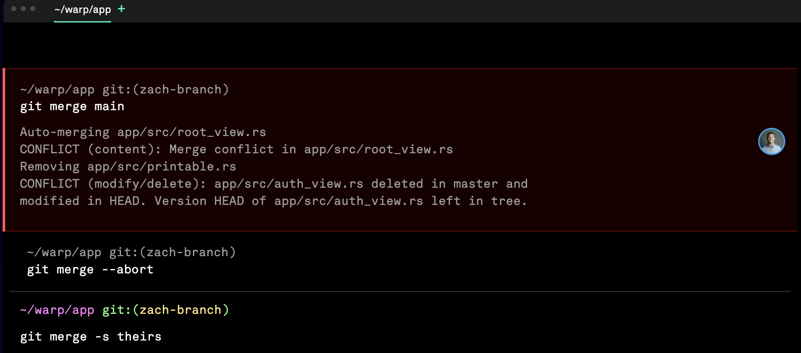
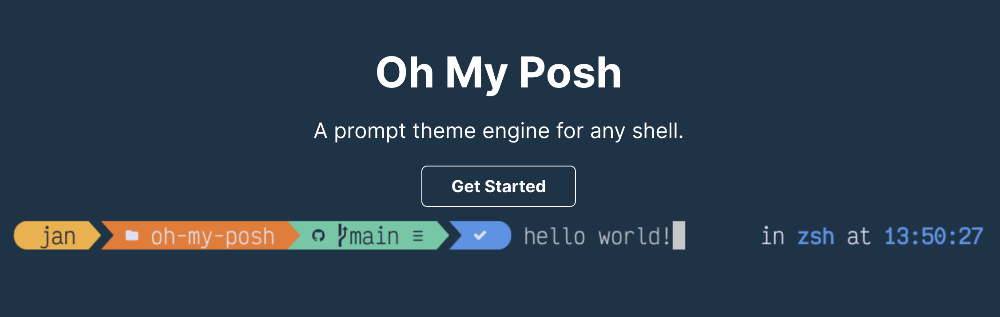

<!-- truncate -->

> 前言:

`Terminal(终端)`也许是开发人员每天都需要打交道的工具 , 相信许多人拿到手都会个性化配置来让其更加 `智能` , 为了防止以后重装系统啥的忘记备份, 在此用文章记录

## Mac

### 终端软件的选择

#### Item2 ? Warp !

> `Item2` 截至目前依然是 `Mac OS` 使用最广泛的 终端, 但我在体验了 `Warp` 之后主力终端也换成了 `Warp`

如果你也对 `Wrap` 感兴趣, 可以看看这篇文章 [超越 iTerm！号称下一代 Terminal 终端神器，用完爱不释手](https://juejin.cn/post/7089224236941721607)




### oh-my-zsh

```bash
# 1.查看当前系统 shell
echo $SHELL

# 2.查看系统安装的 shell
cat /etc/shells

# 3. 安装oh-my-zsh(安装失败请使用魔法 / 或者自行克隆仓库做镜像)
sh -c "$(curl -fsSL https://raw.github.com/robbyrussell/oh-my-zsh/master/tools/install.sh)"

# 4. 查看zsh版本，出来即成功
zsh --version

# 5. 切换系统 shell 为 zsh
chsh -s/bin/zsh

# 6. 重载shell配置以生效
source ~/.zshrc
```

### Font

> 要求 : 跨平台, 开源, 免费, 美观

- [PowerLine](https://github.com/powerline/powerline)
- [MesloLGM NF](https://www.nerdfonts.com/)
- Whatever you like...

### Theme

> 采用 spaceship 主题, 简介美观

```bash
# 1. 克隆主题仓库
git clone https://github.com/spaceship-prompt/spaceship-prompt.git "$ZSH_CUSTOM/themes/spaceship-prompt" --depth=1

# 2.软连接目录到本地克隆仓库
ln -s "$ZSH_CUSTOM/themes/spaceship-prompt/spaceship.zsh-theme" "$ZSH_CUSTOM/themes/spaceship.zsh-theme"

# 3. 配置zshrc文件
vim ~/.zshrc # 编辑zshrc文件
ZSH_THEME="spaceship"  #配置zsh主题为spaceship

# 4. 重载zsh配置以生效
source ~/.zshrc

# 5. (可选) 配置别名 , zsh 可玩性非常高 , 感兴趣自行研究
## git lias
alias gc='git clone'
alias gs='git status'
alias gd='git diff'
alias ga='git add .'
alias gap='git add -p'
alias gcm='git commit -m'
alias gca='git commit --amend'
alias gco='git checkout'
alias gcob='git checkout -b'
alias gcom='git checkout master'
alias gcp='git cherry-pick'
alias gb='git branch'
alias gba='git branch -a'
alias gbd='git branch -d'
alias gbr='git branch -r'
alias gp='git pull'
alias gpr='git pull --rebase'
alias gpu='git push'
alias gpf='git push --force'
alias gpnv='git push --no-verify'
alias gl='git log'
alias glg='git log --graph'
alias grl='git reflog'

## npm scripts
alias dev='npm run dev'
alias start='npm run start'
alias build='npm run build'
alias test='npm run test'
alias deploy='npm run deploy'
```

### config

- 开启鼠标左键选中即复制, 右键粘贴
- 开启大小写匹配
- **shell alias & plugins**(in `~/.zshrc` )

```bash
# export config
export ZSH="$HOME/.oh-my-zsh"
export NVM_DIR=~/.nvm

# Theme
ZSH_THEME="spaceship"

# plugins
plugins=(git git-open )

# source oh-my-zsh, nvm
source $ZSH/oh-my-zsh.sh
source $(brew --prefix nvm)/nvm.sh

# User configuration


#  aliases

## git lias
alias gc='git clone'
alias gs='git status'
alias gd='git diff'
alias ga='git add .'
alias gap='git add -p'
alias gcm='git commit -m'
alias gca='git commit --amend'
alias gco='git checkout'
alias gcob='git checkout -b'
alias gcom='git checkout master'
alias gcp='git cherry-pick'
alias gb='git branch'
alias gba='git branch -a'
alias gbd='git branch -d'
alias gbr='git branch -r'
alias gp='git pull'
alias gpr='git pull --rebase'
alias gpu='git push'
alias gpf='git push --force'
alias gpnv='git push --no-verify'
alias gl='git log'
alias glg='git log --graph'
alias grl='git reflog'


## npm scripts
alias dev='npm run dev'
alias start='npm run start'
alias build='npm run build'
alias test='npm run test'
alias deploy='npm run deploy'
alias coverage='npm run coverage'
alias vitepress='yarn docs:dev'
```

## Windows

> Windows Terminal

:::tip 微软官方提供了 Windows Terminal

支持 `Powershell` , `Comand Line Tool`, `Azure` , `WSL2`

:::

### Powershell

`Windows` 不是 `类 Unix 系` , 所以也不支持 `Linux/ Macos` 上的 `zsh` , 但微软有自己的 `Powershell` 😠

> Oh my posh

可以理解将 `oh-my-posh` 理解为 `windows` 版本的 `oh-my-zsh` , 安装参考官方文档 [oh-my-posh](https://ohmyposh.dev/)



### Font

- [MesloLGM NF](https://www.nerdfonts.com/)

### config

- Powershell 配置文件无了, 因为系统使用的是` Win11 开发者版本`, 基本 `1~2` 天就会更新并带来新的 BUG, 现在 Windows Terminal 也打不开闪退了, 日后有空再折腾 😄
