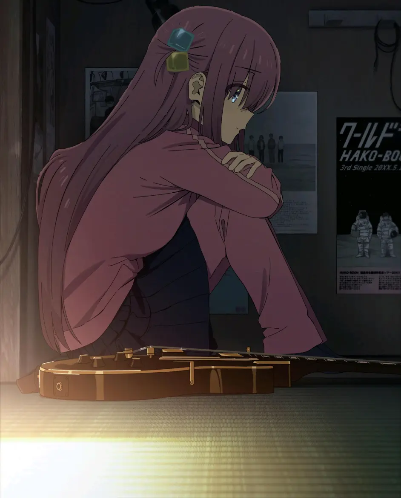

波奇酱镇楼, 今年的番质量真蛮高的, 今年彻底入宅可谓是遇上了好时机, 这个年纪还有这么好的追番体验, 真不错啊~ 也顺便补了许多经典番, 二次元就是这样的 😅, 二次元哪有不疯的 , 硬撑罢了 !

<!-- truncate -->

## 一月番

### 《86, 不存在的战区》

神番,不解释, 因为最后一集的片段而追了整部番了 😭

### 《戀上換裝娃娃》

看到番名觉得不对胃口, 偶然看了个切片觉得蛮不错的就追番了, 确实也很不错

### 《进击的巨人最终季》

塔塔开!塔塔开!一直摸塔塔开! 艾主席成为 🤡 前的珍贵影像

## 四月番

### 《辉夜大小姐想让我告白》

与其说恋爱番不如说搞笑番, 如果制作组不是 `A1-picture` 且厨力满满, 大概我是不会看的

### 《派对浪客诸葛孔明》

耳朵似乎又响起 `将将,7k7k,将将`

### 《间谍过家家》

与高人气相比之下略显仓促地制作显然小打折扣, 还是很有趣温馨搞笑的家庭题材

## 七月番

### 《契约之吻》

> 因为 `丸户史明` 的原因所以成为七月番我最期待的, 剧情的翻转和白学场景再现都让追番的过程充满乐子

### 《莉可丽丝》

> 花之塔年度最好听 ed, 美少女贴贴啥的最棒了, 剧情一坨大便也无所谓了

### 《繼母的拖油瓶是我的前女友》

### 《异世界迷宫开后宫》

这个更是重量级... 咳咳咳

## 十月番

### 《赛博朋克-边缘行者》

> 夜之城没有活传奇

### 《孤独摇滚》

> 大家其实都面临着社恐和惧怕社交的问题，所以才要努力的走出来。

### 《成為影之实力者！》

> 与烂大街的龙傲天不同, 实力超群的暗影大人竟只是为了满足自己的装 B 欲望而扮猪吃老虎, 不愧是暗影大人!

### 《间谍过家家第二季》

这一季可以打 9/10 , 相比第一季的仓促赶工, 这一季明显观感和制作都能看到感受提升

### 《电锯人》

感觉画质不如... 原神 , 电影感不如...漫画 , 其实也中规中矩, 但或许对它过于期待, 反而最后显得十分平淡吧, `Mappa`制作成本显然是溢出屏幕的, 但画面的精美不能弥补蜜汁 `电影风格` , 这么重量级的项目却启用新人监督, 不知道如何评价, 结果就是市场不买账, 希望后续能做出漫画水平吧, 有生之年希望能看到《炎拳》动画化!
